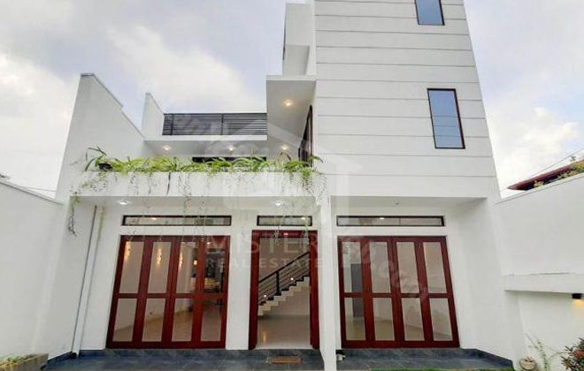

# Manage Page - Bulk Actions & Progress Modal Integration Guide

This document provides detailed instructions for clients with an earlier version of the manage page to integrate the following features:

1. **Desktop Bulk Actions Dropdown** (`#bulkActionsDropdown`)
2. **Mobile Checkbox Selection** (`.mobile-ad-checkbox` within `.agent-mobile-ad`)
3. **Mobile Bulk Actions Bottom Sheet** (`#bulkActionsMobileModal`)
4. **Progress Modal** (`#progressModal`)

---

## Table of Contents

- [1. Desktop Bulk Actions Dropdown](#1-desktop-bulk-actions-dropdown)
- [2. Mobile Checkbox Selection](#2-mobile-checkbox-selection)
- [3. Mobile Bulk Actions Bottom Sheet](#3-mobile-bulk-actions-bottom-sheet)
- [4. Progress Modal](#4-progress-modal)
- [5. JavaScript Implementation](#5-javascript-implementation)
- [6. CSS Styles](#6-css-styles)
- [7. Integration Order](#7-integration-order)

---

## 1. Desktop Bulk Actions Dropdown

### HTML Structure

Add the following inside your `#selectedItemsOptions` container (this container should already exist):

```html
<!-- Desktop Bulk Actions Dropdown (hidden on mobile) -->
<div class="dropdown d-none d-md-block">
    <button
            class="btn btn-dark dropdown-toggle"
            type="button"
            id="bulkActionsDropdown"
            data-bs-toggle="dropdown"
            aria-expanded="false"
    >
        <i class="bi bi-three-dots-vertical"></i> Bulk actions
    </button>
    <ul class="dropdown-menu dropdown-menu-dark" aria-labelledby="bulkActionsDropdown">
        <li>
            <button
                    class="dropdown-item dropdown-item-set-status"
                    id="setStatusBtn"
            >
                <svg
                        width="20"
                        height="20"
                        viewBox="0 0 24 24"
                        fill="none"
                        xmlns="http://www.w3.org/2000/svg"
                        style="margin-right: 8px;"
                >
                    <path
                            d="M7 18C5.33333 18 3.91667 17.4167 2.75 16.25C1.58333 15.0833 1 13.6667 1 12C1 10.3333 1.58333 8.91667 2.75 7.75C3.91667 6.58333 5.33333 6 7 6H17C18.6667 6 20.0833 6.58333 21.25 7.75C22.4167 8.91667 23 10.3333 23 12C23 13.6667 22.4167 15.0833 21.25 16.25C20.0833 17.4167 18.6667 18 17 18H7ZM7 15C7.83333 15 8.54167 14.7083 9.125 14.125C9.70833 13.5417 10 12.8333 10 12C10 11.1667 9.70833 10.4583 9.125 9.875C8.54167 9.29167 7.83333 9 7 9C6.16667 9 5.45833 9.29167 4.875 9.875C4.29167 10.4583 4 11.1667 4 12C4 12.8333 4.29167 13.5417 4.875 14.125C5.45833 14.7083 6.16667 15 7 15Z"
                            fill="currentColor"
                    />
                </svg>
                Set Status
            </button>
        </li>
        <li>
            <button
                    class="dropdown-item dropdown-item-assign-user"
                    id="assignToUserBtn"
            >
                <i class="bi bi-people-fill" style="margin-right: 8px;"></i>
                Assign To User
            </button>
        </li>
        <li>
            <button
                    class="dropdown-item dropdown-item-share"
                    id="shareBtn"
                    data-bs-toggle="modal"
                    data-bs-target="#selectedAdsActionsModal"
            >
                <i class="bi bi-share-fill" style="margin-right: 8px;"></i>
                Share selected ads
            </button>
        </li>
        <li>
            <button
                    class="dropdown-item dropdown-item-boost"
                    id="boostBtn"
                    data-bs-toggle="modal"
                    data-bs-target="#selectedAdsActionsModal"
            >
                <i class="bi bi-rocket-takeoff-fill" style="margin-right: 8px;"></i>
                Boost selected ads
            </button>
        </li>
        <li>
            <button
                    class="dropdown-item dropdown-item-deactivate"
                    id="deactivateBtn"
                    data-bs-toggle="modal"
                    data-bs-target="#selectedAdsActionsModal"
            >
                <svg
                        width="20"
                        height="20"
                        viewBox="0 0 24 24"
                        fill="none"
                        xmlns="http://www.w3.org/2000/svg"
                        style="margin-right: 8px;"
                >
                    <mask
                            id="mask0_1_1574"
                            style="mask-type: alpha"
                            maskUnits="userSpaceOnUse"
                            x="0"
                            y="0"
                            width="24"
                            height="24"
                    >
                        <rect width="24" height="24" fill="#D9D9D9"/>
                    </mask>
                    <g mask="url(#mask0_1_1574)">
                        <path
                                d="M9.12634 17.0237L12.0152 14.1348L14.9041 17.0237L16.4597 15.4681L13.5708 12.5792L16.4597 9.69035L14.9041 8.13479L12.0152 11.0237L9.12634 8.13479L7.57079 9.69035L10.4597 12.5792L7.57079 15.4681L9.12634 17.0237ZM6.45968 22.0237C5.84857 22.0237 5.32542 21.8061 4.89023 21.3709C4.45505 20.9357 4.23745 20.4126 4.23745 19.8015V5.35702H3.12634V3.13479H8.6819V2.02368H15.3486V3.13479H20.9041V5.35702H19.793V19.8015C19.793 20.4126 19.5754 20.9357 19.1402 21.3709C18.705 21.8061 18.1819 22.0237 17.5708 22.0237H6.45968Z"
                                fill="currentColor"
                        />
                    </g>
                </svg>
                Delete selected ads
            </button>
        </li>
    </ul>
</div>
```

---

## 2. Mobile Checkbox Selection

### HTML Changes

For each mobile listing item with class `.agent-mobile-ad`, add the checkbox and visual circle inside the `.ad-image` container:

```html
<div class="ad-image col-4 position-relative">
    <!-- ADD: Checkbox input (hidden, used for selection logic) -->
    <input
            class="form-check-input mobile-ad-checkbox"
            id="mobileAdItem1"
            type="checkbox"
            value=""
    />
    <!-- ADD: Visual circular checkbox indicator -->
    <div class="checkbox-circle">
        <i class="bi bi-check-lg"></i>
    </div>
    
    <!-- Existing image -->
    
</div>
```

> [!IMPORTANT]
> - Each checkbox should have a **unique ID** (e.g., `mobileAdItem1`, `mobileAdItem2`, etc.)
> - The checkbox and circle must be placed **before** the image within the `.ad-image` container

---

## 3. Mobile Bulk Actions Bottom Sheet

### HTML Structure

Add this at the end of your page, before the closing `</body>` tag (outside of any other modals):

```html
<!-- Bulk Actions Mobile Bottom Sheet (Custom Implementation) -->
<div
        class="custom-bottom-sheet"
        id="bulkActionsMobileModal"
        aria-hidden="true"
>
    <div class="bottom-sheet-content bulk-actions-sheet">
        <div class="bottom-sheet-body p-0">
            <div class="bulk-actions-container d-flex align-items-center gap-1">
                <!-- Left 50% - Count Box & Title -->
                <div class="bulk-actions-left">
                    <div class="selected-count-box">
                        <span>1</span>
                    </div>
                    <div class="bulk-actions-info">
                        <h5 class="bulk-actions-title">Boost Selected Ads</h5>
                        <p class="bulk-actions-subtitle">Increase visibility of your ads</p>
                    </div>
                </div>

                <!-- Right 50% - Action Dropdown -->
                <div class="bulk-actions-right">
                    <div class="dropup w-100" style="position: relative;">
                        <button
                                class="btn btn-dark dropdown-toggle w-100"
                                type="button"
                                id="bulkActionsMobileDropdown"
                                data-bs-toggle="dropdown"
                                aria-expanded="false"
                        >
                            <i class="bi bi-three-dots-vertical"></i> Bulk Actions
                        </button>
                        <ul class="dropdown-menu dropdown-menu-dark" aria-labelledby="bulkActionsMobileDropdown" style="min-width: 200px;">
                            <li>
                                <button
                                        class="dropdown-item dropdown-item-set-status mobile-action-item"
                                        data-action="status"
                                >
                                    <svg
                                            width="20"
                                            height="20"
                                            viewBox="0 0 24 24"
                                            fill="none"
                                            xmlns="http://www.w3.org/2000/svg"
                                            style="margin-right: 8px;"
                                    >
                                        <path
                                                d="M7 18C5.33333 18 3.91667 17.4167 2.75 16.25C1.58333 15.0833 1 13.6667 1 12C1 10.3333 1.58333 8.91667 2.75 7.75C3.91667 6.58333 5.33333 6 7 6H17C18.6667 6 20.0833 6.58333 21.25 7.75C22.4167 8.91667 23 10.3333 23 12C23 13.6667 22.4167 15.0833 21.25 16.25C20.0833 17.4167 18.6667 18 17 18H7ZM7 15C7.83333 15 8.54167 14.7083 9.125 14.125C9.70833 13.5417 10 12.8333 10 12C10 11.1667 9.70833 10.4583 9.125 9.875C8.54167 9.29167 7.83333 9 7 9C6.16667 9 5.45833 9.29167 4.875 9.875C4.29167 10.4583 4 11.1667 4 12C4 12.8333 4.29167 13.5417 4.875 14.125C5.45833 14.7083 6.16667 15 7 15Z"
                                                fill="currentColor"
                                        />
                                    </svg>
                                    Set Status
                                </button>
                            </li>
                            <li>
                                <button
                                        class="dropdown-item dropdown-item-assign-user mobile-action-item"
                                        data-action="assign"
                                >
                                    <i class="bi bi-people-fill" style="margin-right: 8px;"></i>
                                    Assign To User
                                </button>
                            </li>
                            <li>
                                <button
                                        class="dropdown-item dropdown-item-share mobile-action-item"
                                        data-action="share"
                                >
                                    <i class="bi bi-share-fill" style="margin-right: 8px;"></i>
                                    Share selected ads
                                </button>
                            </li>
                            <li>
                                <button
                                        class="dropdown-item dropdown-item-boost mobile-action-item"
                                        data-action="boost"
                                >
                                    <i class="bi bi-rocket-takeoff-fill" style="margin-right: 8px;"></i>
                                    Boost selected ads
                                </button>
                            </li>
                            <li>
                                <button
                                        class="dropdown-item dropdown-item-deactivate mobile-action-item"
                                        data-action="deactivate"
                                >
                                    <svg
                                            width="20"
                                            height="20"
                                            viewBox="0 0 24 24"
                                            fill="none"
                                            xmlns="http://www.w3.org/2000/svg"
                                            style="margin-right: 8px;"
                                    >
                                        <mask
                                                id="mask0_mobile_delete"
                                                style="mask-type: alpha"
                                                maskUnits="userSpaceOnUse"
                                                x="0"
                                                y="0"
                                                width="24"
                                                height="24"
                                        >
                                            <rect width="24" height="24" fill="#D9D9D9"/>
                                        </mask>
                                        <g mask="url(#mask0_mobile_delete)">
                                            <path
                                                    d="M9.12634 17.0237L12.0152 14.1348L14.9041 17.0237L16.4597 15.4681L13.5708 12.5792L16.4597 9.69035L14.9041 8.13479L12.0152 11.0237L9.12634 8.13479L7.57079 9.69035L10.4597 12.5792L7.57079 15.4681L9.12634 17.0237ZM6.45968 22.0237C5.84857 22.0237 5.32542 21.8061 4.89023 21.3709C4.45505 20.9357 4.23745 20.4126 4.23745 19.8015V5.35702H3.12634V3.13479H8.6819V2.02368H15.3486V3.13479H20.9041V5.35702H19.793V19.8015C19.793 20.4126 19.5754 20.9357 19.1402 21.3709C18.705 21.8061 18.1819 22.0237 17.5708 22.0237H6.45968Z"
                                                    fill="currentColor"
                                            />
                                        </g>
                                    </svg>
                                    Delete selected ads
                                </button>
                            </li>
                        </ul>
                    </div>
                </div>
            </div>
        </div>
    </div>
</div>
```

---

## 4. Progress Modal

### HTML Structure

Add this modal at the end of your page (before the closing `</body>` tag):

```html
<!-- Progress Modal -->
<div class="modal fade slide-up bottom-sheet-modal" id="progressModal" tabindex="-1" aria-labelledby="progressModalLabel" aria-hidden="true">
    <div class="modal-dialog modal-dialog-centered">
        <div class="modal-content">
            <!-- Drag Handle -->
            <div class="text-center pt-3 pb-2">
                <div class="drag-handle mx-auto"></div>
            </div>
            
            <!-- Header -->
            <div class="px-4 pb-2 d-flex justify-content-between align-items-center" id="modalHeader">
                <div style="width: 32px;"></div>
                <h2 class="fs-6 fw-bold mb-0">Boosting Ad</h2>
                <button type="button" class="btn btn-close" data-bs-dismiss="modal">
                </button>
            </div>
            
            <!-- Body -->
            <div class="modal-body px-4 pb-4 text-center">
                <!-- Progress Content -->
                <div id="progressContent">
                <!-- Progress Circle -->
                <div class="progress-circle-container mb-2 mx-auto">
                    <svg class="progress-circle" width="225" height="225" viewBox="0 0 256 256">
                        <defs>
                            <linearGradient id="gradient-progress" x1="0%" y1="100%" x2="100%" y2="0%">
                                <stop offset="0%" stop-color="#22c55e"/>
                                <stop offset="100%" stop-color="#22c55e"/>
                            </linearGradient>
                        </defs>
                        <circle class="progress-circle-bg" cx="128" cy="128" r="110"/>
                        <circle class="progress-circle-fill" id="progressCircle" cx="128" cy="128" r="110" stroke="url(#gradient-progress)"/>
                    </svg>
                    
                    <div class="circle-content">
                        <div class="page-number" id="targetPage">4</div>
                        <div class="page-label">Page no.</div>
                        <div class="arrow-boost">
                            <i class="bi bi-chevron-up"></i>
                            <i class="bi bi-chevron-up"></i>
                            <i class="bi bi-chevron-up"></i>
                        </div>
                    </div>
                </div>
                
                <!-- Status Indicator -->
                <div class="d-flex align-items-center justify-content-center gap-3 mb-4 status-indicator">
                    <span class="position-relative d-flex" style="height: 12px; width: 12px;">
                        <span class="position-absolute top-0 start-0 ping rounded-circle opacity-75" style="height: 12px; width: 12px;"></span>
                        <span class="position-relative rounded-circle" style="height: 12px; width: 12px;"></span>
                    </span>
                    <span class="fw-bold fs-5 text-uppercase" style="letter-spacing: 0.05em;">Boosting your ad</span>
                </div>
                
                <!-- Position Comparison -->
                <div class="bg-light rounded-4 px-3 py-3 mb-4 border position-container" style="max-width: 320px; margin: 0 auto;">
                    <div class="row align-items-center justify-content-between g-2">
                        <div class="col text-start text-col">
                            <small class="text-uppercase d-block">Current Pos.</small>
                            <div class="text-num" id="currentPage">Page 18</div>
                        </div>
                        <div class="col-auto">
                            <div class="bg-white rounded-circle shadow-sm d-flex align-items-center justify-content-center" style="width: 32px; height: 32px;">
                                <span class="bi bi-arrow-right text-secondary" style="font-size: 1.125rem;"></span>
                            </div>
                        </div>
                        <div class="col text-end text-col">
                            <small class="text-uppercase d-block">New Pos.</small>
                            <div class="text-num progress-text-green" id="newPage">Page 4</div>
                        </div>
                    </div>
                </div>
                
                <!-- Message -->
                <div class="mb-4 px-4 msg-container">
                    <h3 class="fs-5 fw-bold mb-2">Your ad is being boosted.</h3>
                    <p class="text-secondary">Please check in 5-10 mins to see the changes.</p>
                </div>
                </div>
                
                <!-- Success Content (Initially Hidden) -->
                <div id="successContent" class="d-none">
                    <!-- Success Badge -->
                    <div class="d-flex align-items-center justify-content-center gap-1 mb-4">
                        <span class="bi bi-check-circle-fill success-badge-icon"></span>
                        <span class="fw-bold text-uppercase success-badge-text">Boosted</span>
                    </div>
                    
                    <!-- Success Circle -->
                    <div class="mb-4">
                        <div class="success-circle mx-auto">
                            <div class="success-number" id="successPageNumber">4</div>
                            <div class="success-label">Page no.</div>
                        </div>
                    </div>
                    
                    <!-- Success Message -->
                    <div class="mb-4 suscess-msg-box">
                        <h1 class="fs-5 fw-bold mb-2 success-title">Success! Your ad is boosted</h1>
                        <p class="text-secondary px-3">Your listing jumped from <span id="successFromPage">page 18</span> to <span id="successToPage">page 4</span> for maximum exposure.</p>
                    </div>
                    
                    <!-- Comparison -->
                    <div class="bg-light rounded-4 px-3 py-3 mb-4 border position-container" style="max-width: 320px; margin: 0 auto;">
                        <div class="row align-items-center justify-content-between g-2">
                            <div class="col text-start text-col">
                                <small class="text-uppercase d-block">Initial</small>
                                <div class="text-num text-muted text-decoration-line-through" id="successInitialPage">Page 18</div>
                            </div>
                            <div class="col-auto">
                                <div class="bg-white rounded-circle shadow-sm d-flex align-items-center justify-content-center" style="width: 32px; height: 32px;">
                                    <span class="bi bi-graph-up-arrow text-success" style="font-size: 1.125rem;"></span>
                                </div>
                            </div>
                            <div class="col text-end text-col">
                                <small class="progress-text-green text-uppercase d-block">New Position</small>
                                <div class="text-num progress-text-green" id="successFinalPage">Page 4</div>
                            </div>
                        </div>
                    </div>
                    
                    <!-- Upgrade CTA -->
                    <div class="rounded-4 p-3 mb-3 success-upgrade-box">
                        <div class="mb-3 text-center">
                            <div class="text-primary fw-bold mb-1 success-upgrade-title">Reach page 1 or 2</div>
                            <p class="text-muted small mb-0 getmore-text">Get 3x more visibility by upgrading</p>
                        </div> 
                        <button class="btn btn-primary w-100 rounded-4 d-flex align-items-center justify-content-center gap-2 fw-bold success-upgrade-btn">
                            <span class="bi bi-rocket-takeoff-fill"></span>
                            <span>Upgrade your ad now</span>
                        </button>
                    </div>
                    
                    <!-- Done Button -->
                    <button class="btn w-100 text-secondary success-done-btn border-0" data-bs-dismiss="modal">Done</button>
                </div>
                
            </div>
        </div>
    </div>
</div>
```

---

## 5. JavaScript Implementation

Add the following JavaScript to your `manage.js` file:

### 5.1 Checkbox Visibility Toggle Function

```javascript
// Function to toggle selected options container visibility
function toggleSelectedOptionsVisibility() {
    // Use jQuery to select checkboxes and container
    const $propertyCheckboxes = $('.property-item input[type="checkbox"][id^="propertyListItem"]');
    const $mobileCheckboxes = $('.mobile-ad-checkbox');
    const $selectedOptionsContainer = $('#selectedItemsOptions');

    // Check if at least one checkbox is checked (from either property items or mobile items)
    const propertyAtLeastOneChecked = $propertyCheckboxes.is(':checked');
    const mobileAtLeastOneChecked = $mobileCheckboxes.is(':checked');
    const atLeastOneChecked = propertyAtLeastOneChecked || mobileAtLeastOneChecked;

    // Show/hide the selected options container based on checkbox state
    if (atLeastOneChecked) {
        $selectedOptionsContainer.removeClass('d-none').addClass('d-flex');
    } else {
        $selectedOptionsContainer.removeClass('d-flex').addClass('d-none');
    }
}

// Add event listeners to all property item checkboxes
$(document).on('change', '.property-item input[type="checkbox"][id^="propertyListItem"]', function () {
    toggleSelectedOptionsVisibility();
});

// Add event listeners to all mobile ad checkboxes
$(document).on('change', '.mobile-ad-checkbox', function () {
    toggleSelectedOptionsVisibility();
});

// Handle click on agent-mobile-ad container to toggle checkbox (mobile UX)
$(document).on('click', '.agent-mobile-ad', function (e) {
    // Get the checkbox inside this container
    const $checkbox = $(this).find('.mobile-ad-checkbox');
    
    // Check if clicked element is a button or interactive element that shouldn't trigger checkbox
    const $target = $(e.target);
    
    // If click directly on checkbox, let native behavior handle
    if ($target.hasClass('mobile-ad-checkbox')) {
        return;
    }
    
    const isButton = $target.closest('button').length > 0 || $target.closest('.btn').length > 0;
    const isInteractiveIcon = $target.closest('[data-bs-toggle]').length > 0 || $target.closest('.dot-popover').length > 0 || $target.closest('.custom-switch').length > 0;
    
    // If click is on a button or interactive element, don't toggle checkbox
    if (isButton || isInteractiveIcon) {
        return;
    }
    
    // Toggle the checkbox
    if ($checkbox.length) {
        $checkbox.prop('checked', !$checkbox.prop('checked'));
        $checkbox.trigger('change');
    }
});

// Initialize the visibility state on page load
toggleSelectedOptionsVisibility();
```

### 5.2 Mobile Bottom Sheet Helper Functions

```javascript
// ===== Mobile Bottom Sheet Handlers =====

// Custom bottom sheet helper functions (replaces Bootstrap modal)
function showBottomSheet(elementId) {
    const bottomSheet = document.getElementById(elementId);
    if (bottomSheet) {
        bottomSheet.classList.add('show');
        bottomSheet.setAttribute('aria-hidden', 'false');
    }
}

function hideBottomSheet(elementId) {
    const bottomSheet = document.getElementById(elementId);
    if (bottomSheet) {
        bottomSheet.classList.remove('show');
        bottomSheet.setAttribute('aria-hidden', 'true');
    }
}

// Show/hide mobile bottom sheet on checkbox selection
$(document).on('change', '.mobile-ad-checkbox', function () {
    // Only handle on mobile (< 768px)
    if (window.innerWidth < 768) {
        // Count how many checkboxes are currently checked
        const checkedCount = $('.mobile-ad-checkbox:checked').length;
        
        if (checkedCount > 0) {
            // Show bottom sheet if at least one checkbox is checked
            showBottomSheet('bulkActionsMobileModal');
        } else {
            // Hide bottom sheet if no checkboxes are checked
            hideBottomSheet('bulkActionsMobileModal');
        }
    }
});

// Handle mobile action item selection from dropdown
$(document).on('click', '.mobile-action-item', function (e) {
    e.preventDefault();
    
    const actionType = $(this).data('action');

    // Close the dropdown
    const dropdownBtn = document.getElementById('bulkActionsMobileDropdown');
    const dropdown = bootstrap.Dropdown.getInstance(dropdownBtn);
    if (dropdown) {
        dropdown.hide();
    }

    // Execute action directly
    executeMobileAction(actionType);
});

// Execute the selected mobile action
function executeMobileAction(actionType) {
    if (actionType === 'boost') {
        console.log('Mobile: Boosting selected ads...');
    } else if (actionType === 'deactivate') {
        console.log('Mobile: Deactivating selected ads...');
    } else if (actionType === 'share') {
        console.log('Mobile: Sharing selected ads...');
    } else if (actionType === 'status') {
        console.log('Mobile: Setting status for selected ads...');
    } else if (actionType === 'assign') {
        console.log('Mobile: Assigning user for selected ads...');
    }
    
    // Close the bottom sheet
    setTimeout(() => {
        hideBottomSheet('bulkActionsMobileModal');
    }, 200);
}

// Close bottom sheet when clicking outside of it
$(document).on('click', '.custom-bottom-sheet.show', function(e) {
    if (e.target === this) {
        hideBottomSheet('bulkActionsMobileModal');
    }
});
```

### 5.3 Progress Modal Implementation

```javascript
// ===== Progress Modal Configuration =====
const config = {
    currentPage: 18,
    targetPage: 4
};

// Bootstrap modal instance
let progressModal;

// Calculate progress
function calculateProgress(current, target) {
    const totalPages = current;
    const progress = (totalPages - target) / totalPages;
    return Math.min(Math.max(progress, 0), 1);
}

// Animate progress circle
function animateProgress() {
    return new Promise((resolve) => {
        const progress = calculateProgress(config.currentPage, config.targetPage);
        const radius = 110;
        const circumference = 2 * Math.PI * radius; // 691.15 approximately
        const offset = circumference * (1 - progress); // Calculate target offset
        
        const $circle = $('#progressCircle');
        
        // First, reset the circle to 0% progress (full offset)
        $circle.css({
            'stroke-dasharray': circumference,
            'stroke-dashoffset': circumference,  // Start at 0% progress
            'transition': 'none'  // Disable transition for instant reset
        });
        
        // Force reflow to apply the reset immediately
        $circle[0].offsetHeight;
        
        // Re-enable transition and animate to target
        setTimeout(function() {
            $circle.css({
                'transition': 'stroke-dashoffset 1.5s ease-in-out',
                'stroke-dashoffset': offset  // Animate to target progress
            });
            console.log('Animation triggered:', { progress, circumference, offset });
            
            // Wait for CSS transition (1.5s) to complete
            setTimeout(resolve, 1500);
        }, 100);
    });
}

// Initialize progress view
function initProgressView() {
    $('#targetPage').text(config.targetPage);
    $('#currentPage').text('Page ' + config.currentPage);
    $('#newPage').text('Page ' + config.targetPage);
    
    animateProgress().then(() => setTimeout(() => showSuccess(), 1000));
}

// Show success content
function showSuccess() {
    $('#successPageNumber').text(config.targetPage);
    $('#successFromPage').text('page ' + config.currentPage);
    $('#successToPage').text('page ' + config.targetPage);
    $('#successInitialPage').text('Page ' + config.currentPage);
    $('#successFinalPage').text('Page ' + config.targetPage);
    
    // Hide progress content and show success content
    $('#progressContent').addClass('d-none');
    $('#successContent').removeClass('d-none');
    
    // Hide the header when showing success content
    $('#modalHeader').addClass('d-none');
}

// Public API for external use (if needed)
$.fn.updateBoostConfig = function(currentPage, targetPage) {
    config.currentPage = currentPage;
    config.targetPage = targetPage;
    initProgressView();
    return this;
};

$.fn.showProgressModal = function() {
    // Reset to show progress content
    $('#progressContent').removeClass('d-none');
    $('#successContent').addClass('d-none');
    $('#modalHeader').removeClass('d-none');
    
    progressModal.show();
    return this;
};

// Initialize modal
progressModal = new bootstrap.Modal('#progressModal');

// Handle progress modal show event - animate when modal becomes visible
document.getElementById('progressModal').addEventListener('shown.bs.modal', function() {
    // Reset to show progress content when modal opens
    $('#progressContent').removeClass('d-none');
    $('#successContent').addClass('d-none');
    $('#modalHeader').removeClass('d-none');
    
    initProgressView();
});

// Event handlers
$('#btnMinimize').on('click', showSuccess);

// IMPORTANT: This is how to trigger the progress modal from btnYesBoost
$('#btnYesBoost').on("click",()=>{
    progressModal.show();
});
```

> [!WARNING]
> The `btnYesBoost` button click handler is how the progress modal is triggered. Make sure you have a button with `id="btnYesBoost"` in your Boost confirmation modal (or adjust the selector to match your implementation).

---

## 6. CSS Styles

Add the following CSS/SCSS to your stylesheet:

### 6.1 Mobile Checkbox Styles

```scss
// Mobile ad checkbox styling - Custom circular checkbox
.mobile-ad-checkbox {
  position: absolute;
  top: 6px;
  left: 13px;
  width: 16px;
  height: 16px;
  z-index: 11;
  cursor: pointer;
  opacity: 0;
  margin: 0;
}

// Circular background for checkbox
.checkbox-circle {
  position: absolute;
  top: 6px;
  left: 13px;
  width: 16px;
  height: 16px;
  border-radius: 50%;
  display: flex;
  align-items: center;
  justify-content: center;
  pointer-events: none;
  transition: all 0.3s ease;
  z-index: 10;
  background-color: #ffffff;
  border: 2px solid #ffffff;
  box-shadow: 0 2px 4px rgba(0, 0, 0, 0.15);

  i {
    display: none;
    color: #ffffff;
    font-size: 12px;
    font-weight: bold;
  }
}

// When checkbox is checked, change circle color and show checkmark
.mobile-ad-checkbox:checked ~ .checkbox-circle {
  background-color: #018e37;
  border-color: #018e37;
  box-shadow: 0 2px 6px rgba(1, 142, 55, 0.3);

  i {
    display: block;
  }
}

// Hover effect for the ad-image container
.ad-image:hover .checkbox-circle {
  box-shadow: 0 2px 6px rgba(0, 0, 0, 0.2);
}

.mobile-ad-checkbox:checked:hover ~ .checkbox-circle {
  box-shadow: 0 2px 8px rgba(1, 142, 55, 0.4);
}
```

### 6.2 Custom Bottom Sheet Styles

```scss
// Custom Bottom Sheet Implementation (replaces Bootstrap modal to avoid backdrop issues)
.custom-bottom-sheet {
  position: fixed;
  bottom: 0;
  left: 0;
  right: 0;
  z-index: 1055;
  transform: translateY(100%);
  transition: transform 0.3s ease-in-out;
  pointer-events: none;
  padding: 8px;
  
  &.show {
    transform: translateY(0);
    pointer-events: auto;
  }
  
  .bottom-sheet-content {
    max-width: 100%;
    margin: 0 auto;
    border-radius: 10px;
    box-shadow: 0 -4px 12px rgba(0, 0, 0, 0.15);
  }
  
  .bottom-sheet-body {
    padding: 24px;
  }
}

.bulk-actions-sheet {
  background-color: #1a1a1e;
  border-top: 1px solid #333;
  padding: 10px;

  .bottom-sheet-body {
    padding: 24px;
  }
}

.bulk-actions-container {
  display: flex;
  align-items: center;
  gap: 20px;
  min-height: auto;
}

.bulk-actions-left {
  flex: 1;
  display: flex;
  align-items: center;
  gap: 8px;
  min-width: 0;
}

.selected-count-box {
  padding: 5px 10px;
  border-radius: 8px;
  background-color: #0a7ee5;
  display: flex;
  align-items: center;
  justify-content: center;
  flex-shrink: 0;
  font-size: 14px;
  font-weight: normal;

  span {
    font-weight: bold;
    color: white;
  }
}

.bulk-actions-info {
  display: flex;
  flex-direction: column;
  gap: 4px;
  min-width: 0;

  .bulk-actions-title {
    font-size: 14px;
    font-weight: 700;
    color: white;
    margin: 0;
    line-height: 1.2;
  }

  .bulk-actions-subtitle {
    font-size: 12px;
    color: #999;
    margin: 0;
    line-height: 1.2;
  }
}

.bulk-actions-right {
  flex: 0 0 auto;
  display: flex;
  align-items: center;
  justify-content: center;
  .btn {
    font-size: 13px;
    text-transform: uppercase;
  }
}
```

### 6.3 Progress Modal Styles

```scss
#progressModal {
  .btn-close {
    font-size: 12px;
  }
}

.progress-text-green{
  color: #22c55e;
}

/* Drag Handle */
.drag-handle {
  width: 40px;
  height: 6px;
  background: #dbe0e6;
  border-radius: 9999px;
}

/* Progress Circle */
.progress-circle-container {
  position: relative;
  width: 256px;
  height: 256px;
}

.progress-circle {
  transform: rotate(-90deg);
  filter: drop-shadow(0 10px 15px rgba(0, 0, 0, 0.1));
}

.progress-circle-bg {
  fill: transparent;
  stroke: #e5e7eb;
  stroke-width: 12;
}

.progress-circle-fill {
  fill: transparent;
  stroke-width: 12;
  stroke-linecap: round;
  stroke-dasharray: 691;
  stroke-dashoffset: 691;
  transition: stroke-dashoffset 1.5s ease-out;
}

.circle-content {
  position: absolute;
  top: 50%;
  left: 50%;
  transform: translate(-50%, -50%);
  text-align: center;
  padding-top: 10px;
}

.page-number {
  font-size: 52px;
  font-weight: 700;
  line-height: 1;
  margin: 0;
  color: #111418;
}

.page-label {
  font-size: 1rem;
  font-weight: 500;
  color: #6b7280;
  margin: 0.25rem 0 0.5rem 0;
}

/* Arrow Animation */
.arrow-boost {
  display: flex;
  flex-direction: column;
  align-items: center;
  color: #1d85ed;
  animation: arrowBoost 1.5s ease-out infinite;
}

@keyframes arrowBoost {
  0% {
    opacity: 0;
    transform: translateY(10px) scale(0.8);
  }
  20% {
    opacity: 1;
    transform: translateY(0px) scale(1);
  }
  80% {
    opacity: 1;
    transform: translateY(-10px) scale(1.1);
  }
  100% {
    opacity: 0;
    transform: translateY(-20px) scale(1.2);
  }
}

.arrow-boost .bi-chevron-up:nth-child(1) {
  font-size: 16px;
  opacity: 0.5;
}

.arrow-boost .bi-chevron-up:nth-child(2) {
  font-size: 18px;
  opacity: 0.7;
  margin-top: -12px;
}

.arrow-boost .bi-chevron-up:nth-child(3) {
  font-size: 20px;
  margin-top: -15px;
}

/* Status Indicator */
.status-indicator {
  animation: pulseText 2s cubic-bezier(0.4, 0, 0.6, 1) infinite;
  .rounded-circle {
    background-color: #fd7e14;
  }
  color: #fd7e14;
}

@keyframes pulseText {
  0%, 100% {
    opacity: 1;
  }
  50% {
    opacity: 0.7;
  }
}

.ping {
  animation: ping 1s cubic-bezier(0, 0, 0.2, 1) infinite;
}

@keyframes ping {
  75%, 100% {
    transform: scale(2);
    opacity: 0;
  }
}

.position-container {
  .text-col {
    small {
      font-size: 11px;
      letter-spacing: 0.5px;
      color: #6b7280;
    }
    .text-num{
      font-size: 16px;
      font-weight: bold;
    }

    .text-muted{
      color: #9ca3af !important;
    }
  }
}

.msg-container {
  p {
    font-size: 13px;
  }
}

/* Success Circle */
.success-circle {
  width: 128px;
  height: 128px;
  background: #22c55e;
  border-radius: 50%;
  display: flex;
  flex-direction: column;
  align-items: center;
  justify-content: center;
  color: white;
  box-shadow: 0 20px 25px -5px rgba(34, 197, 94, 0.2);
}

.success-number {
  font-size: 3rem;
  font-weight: 900;
  line-height: 1;
}

.success-label {
  font-size: 12px;
  font-weight: 500;
  text-transform: uppercase;
  letter-spacing: 0.1em;
  margin-top: 0.25rem;
  opacity: 0.9;
}

.success-badge-icon {
  font-size: 18px;
  color: #22c55e;
}

.success-badge-text {
  font-size: 18px;
  font-weight: bold;
  letter-spacing: 0.05em;
  color: #22c55e;
}

.suscess-msg-box {
  p {
    font-size: 14px;
  }
}

.success-title {
  letter-spacing: -0.025em;
}

.success-upgrade-box {
  background-color: rgba(29, 133, 237, 0.05);
  border: 1px solid rgba(29, 133, 237, 0.2);

  .getmore-text {
    font-size: 13px;
  }
}

.success-upgrade-title {
  font-size: 16px;
}

.success-upgrade-btn {
  height: 56px;

  .bi {
    font-size: 14px;
  }
}

.success-done-btn {
  font-weight: 500;
  letter-spacing: 0.5px;
  font-size: 14px;
}
```

---

## 7. Integration Order

> [!TIP]
> Follow this order to avoid conflicts and ensure proper functionality:

1. **Add CSS Styles**
   - Add all CSS/SCSS styles from [Section 6](#6-css-styles) to your stylesheet

2. **Add HTML Elements**
   - Add the desktop bulk actions dropdown to `#selectedItemsOptions` ([Section 1](#1-desktop-bulk-actions-dropdown))
   - Update mobile listing items with checkboxes ([Section 2](#2-mobile-checkbox-selection))
   - Add the mobile bottom sheet modal ([Section 3](#3-mobile-bulk-actions-bottom-sheet))
   - Add the progress modal ([Section 4](#4-progress-modal))

3. **Add JavaScript**
   - Add all JavaScript code from [Section 5](#5-javascript-implementation) to your `manage.js`
   - Ensure jQuery and Bootstrap 5 are loaded before your script

4. **Test**
   - Test desktop bulk actions
   - Test mobile checkbox selection and bottom sheet
   - Test progress modal animation (triggered via `#btnYesBoost`)

---

## Summary Checklist

| Component | ID/Class | What to Add |
|-----------|----------|-------------|
| Desktop Dropdown | `#bulkActionsDropdown` | HTML dropdown inside `#selectedItemsOptions` |
| Mobile Checkbox | `.mobile-ad-checkbox` | Input + `.checkbox-circle` in each `.agent-mobile-ad` |
| Mobile Bottom Sheet | `#bulkActionsMobileModal` | Complete HTML structure + CSS + JS handlers |
| Progress Modal | `#progressModal` | Complete HTML structure + CSS + JS (animation + success) |

---

> [!CAUTION]
> Make sure you have Bootstrap 5, jQuery, and Bootstrap Icons loaded in your project for all components to work correctly.
